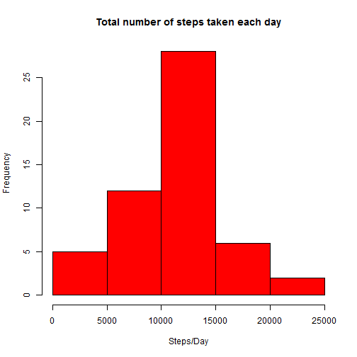
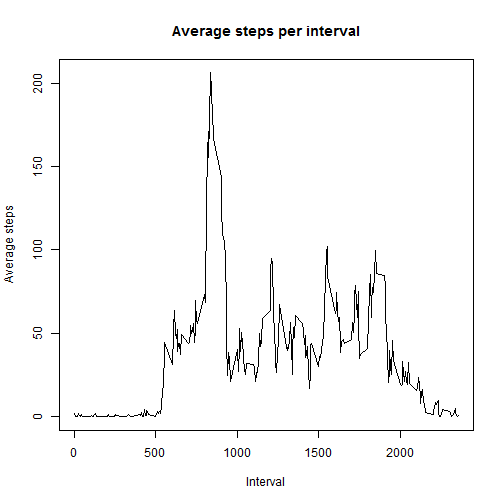
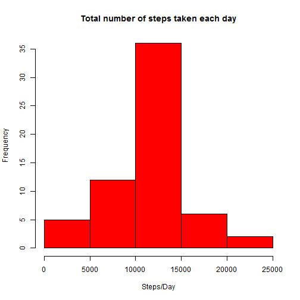
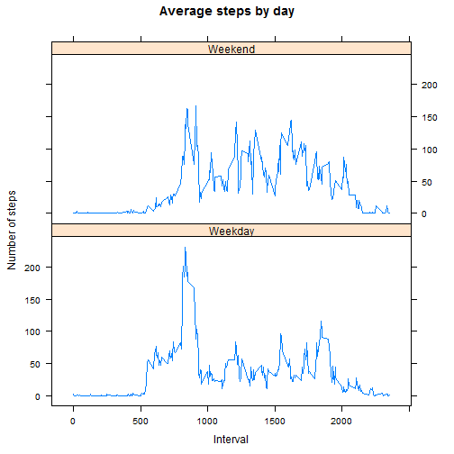

# Reproducible Research - Assignment 1


```r
library(plyr)
library(lattice)
```

```r
# Read the data into R.
data<-read.csv("activity.csv", header=T, sep=",", na.strings="NA")
#Convert the date into date class
data$date<-as.Date(data$date, "%Y-%m-%d")
```

## What is mean total number of steps taken per day?


```r
#Because there are "NA" in the data, clean the data first.
tidydata<-na.omit(data)

#Calculate the total steps for each day.
steps<-aggregate(steps ~ date, tidydata, sum)

#Make the histogram.
hist(steps$steps, main="Total number of steps taken each day", xlab="Steps/Day", col="red")
```

 

```r
#Calculate the mean and median
mean<-mean(steps$steps)
median<-median(steps$steps)
mean
```

```
## [1] 10766.19
```

```r
median
```

```
## [1] 10765
```
The **mean** total number of steps taken per day is: **10766.189**
The **median** total number of steps taken per day is: **10765**

##What is the average daily activity pattern?


```r
#Calculate the average steps with interval.
Interval<-unique(tidydata$interval)
avgStep<-tapply(tidydata$steps, tidydata$interval, mean)

#Make plot.
plot(Interval,avgStep,type="l",ylab="Average steps", main="Average steps per interval")
```

 

```r
#Which 5-minute interval, on average across all the days in the dataset, contains the maximum number of steps?
maxsteps<-names(which.max(avgStep))
maxsteps
```

```
## [1] "835"
```
The **835** 5-minute interval contains the maximum number of steps.

##Imputing missing values

```r
#Calculate and report the total number of missing values in the dataset (i.e. the total number of rows with NAs)
dif<-nrow(data)-nrow(tidydata)
dif
```

```
## [1] 2304
```
The total number of missing values in the dataset is: **2304**


```r
#Devise a strategy for filling in all of the missing values in the dataset. The strategy does not need to be sophisticated. For example, you could use the mean/median for that day, or the mean for that 5-minute interval, etc.
#Create a new dataset that is equal to the original dataset but with the missing data filled in.

isna<-is.na(data)
newdata<-data
newdata$steps[which(isna)]<-avgStep[match(data$interval[which(isna)],data$interval)]
```

```r
#Make a histogram of the total number of steps taken each day and Calculate and report the mean and median total number of steps taken per day. Do these values differ from the estimates from the first part of the assignment? What is the impact of imputing missing data on the estimates of the total daily number of steps?

newsteps<-aggregate(steps ~ date, newdata, sum)
hist(newsteps$steps, main="Total number of steps taken each day", xlab="Steps/Day", col="red",breaks=10)
```

 

```r
mean<-mean(newsteps$steps)
median<-median(newsteps$steps)
mean
```

```
## [1] 10766.19
```

```r
median
```

```
## [1] 10766.19
```
The **mean** and **median** are almost the same as the dataset omitted missing values, with a little difference in the scale of y axis. This is mainly because the NAs are replaced by the average value of the same interval as theirs. Typically doing this would only increase the frequency of each value of "steps/day", would not make any effort to the distribution.

##Are there differences in activity patterns between weekdays and weekends?


```r
#Create a new factor variable in the dataset with two levels - "weekday" and "weekend" indicating whether a given date is a weekday or weekend

day<-newdata$date
newdata<-cbind(newdata,day)
newdata$day<-as.character(weekdays(newdata$day))
newdata$day<-gsub("Monday", "Weekday",newdata$day)
newdata$day<-gsub("Tuesday", "Weekday",newdata$day)
newdata$day<-gsub("Wednesday", "Weekday",newdata$day)
newdata$day<-gsub("Thursday", "Weekday",newdata$day)
newdata$day<-gsub("Friday", "Weekday",newdata$day)
newdata$day<-gsub("Saturday", "Weekend",newdata$day)
newdata$day<-gsub("Sunday", "Weekend",newdata$day)
newdata$day<-as.factor(newdata$day)

#Make a panel plot containing a time series plot (i.e. type = "l") of the 5-minute interval (x-axis) and the average number of steps taken, averaged across all weekday days or weekend days (y-axis). See the README file in the GitHub repository to see an example of what this plot should look like using simulated data


newavgStep <- ddply(newdata, .(interval, day), summarize, steps = mean(steps))

xyplot(steps ~ interval | day, data = newavgStep, type = "l", layout = c(1, 2), 
    xlab = "Interval", ylab = "Number of steps", main = "Average steps by day")
```

 

***The End***


